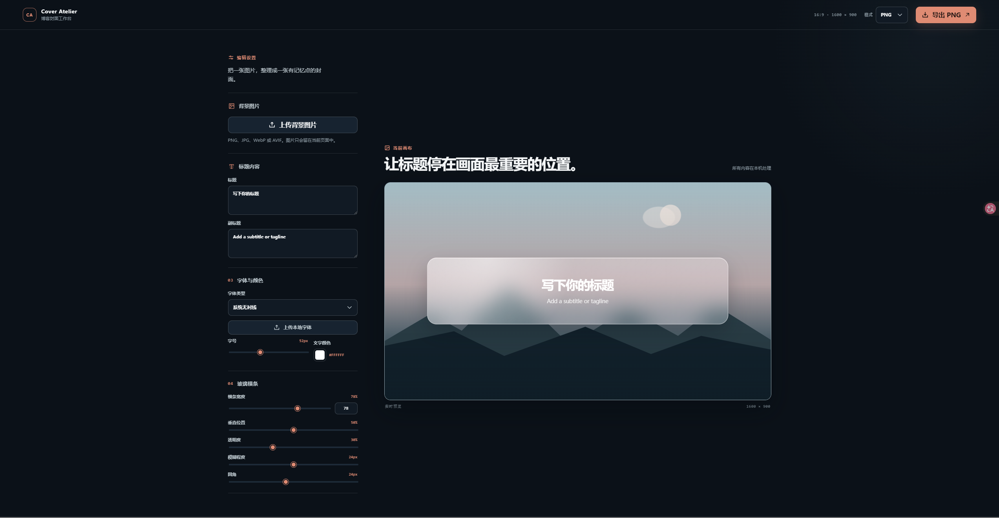

<div align="center">

# Cover Atelier

**一款完全在浏览器中运行、注重隐私的博客封面制作工具。**

[在线体验](https://hubujiu.github.io/cover-atelier/) · [English](./README.md) · [为项目点 Star](https://github.com/Hubujiu/cover-atelier)

</div>



## 功能亮点

- **本地优先。** 选中的图片和字体仅保留在当前浏览器会话中。
- **实时编辑。** 修改标题、副标题、字体、颜色和玻璃条后，预览会立即更新。
- **本地字体。** 可使用已安装的系统字体，也可加载 TTF、OTF、WOFF 和 WOFF2 文件。
- **灵活导出。** 可将 1600 × 900 的封面保存为 PNG、JPEG、WebP 或 AVIF 格式。

## 使用方法

1. 打开[在线体验](https://hubujiu.github.io/cover-atelier/)。
2. 选择背景并编辑封面。
3. 以你偏好的格式导出完成的图片。

## 隐私设计

Cover Atelier 没有应用后端，也不会主动上传你选择的图片或字体。这些文件仅保留在当前页面会话中，并会在刷新或关闭页面时丢弃。

## 本地开发

```powershell
npm install
npm run dev
```

```powershell
npm test
npm run build
```

项目详情请参阅[设计规范](./docs/superpowers/specs/2026-07-10-cover-atelier-design.md)和[实施计划](./docs/superpowers/plans/2026-07-10-cover-atelier.md)。

## 路线图

- 封面预设
- 常用平台尺寸
- 自动配色建议
- 可安装的离线/PWA 支持

## 许可证

[MIT](./LICENSE) © 2026 Hubujiu
